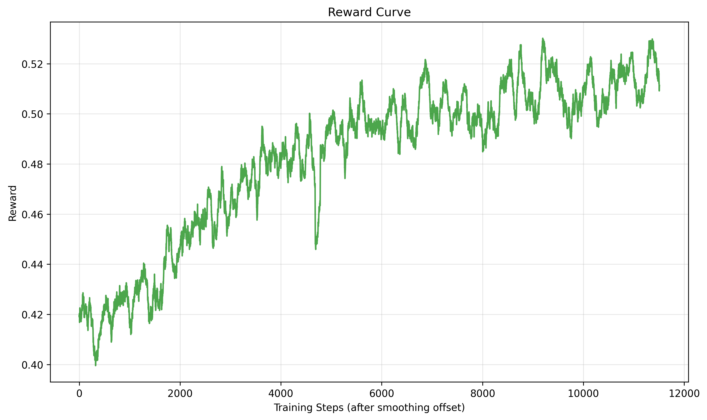
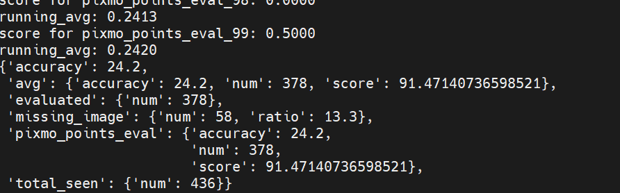
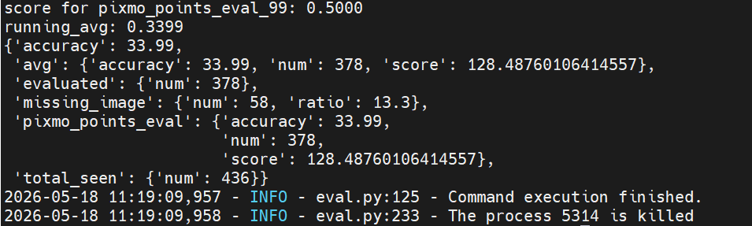

# Training with SWIFT 3.10

- **Launch script**: `./ms-swift-main/examples/train/grpo/internal/rloo_Pixmo_Point.sh`
- **Reward function design**: `./ms-swift-main/swift/plugin/orm.py`  
  The reward function is implemented as the class `Pixmo_Point_Reward`.
- **Reward curve**:  
  

# Evaluation on Pixmo‑Points with FlagEvalMM

- **Launch script**: `./FlagEvalMM/scripts/eval_pixmo_points_eval.sh`
- **Evaluation results**: `./FlagEvalMM/results/`

# Results

| Model | Evaluation Result |
|-------|------------------|
| Qwen3‑VL‑4B (baseline) |  |
| Qwen3‑VL‑4B (trained for 117 steps) |  |